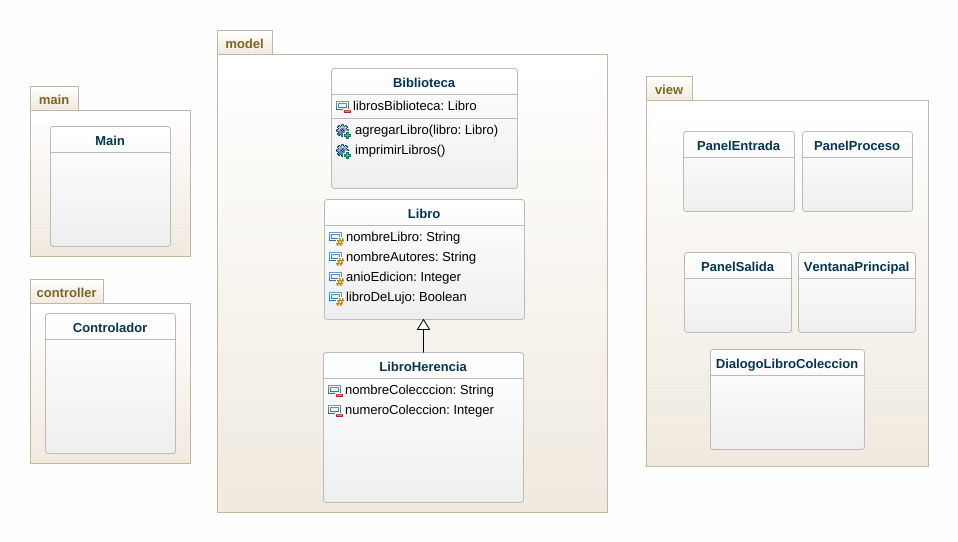

# Caso Biblioteca Herencia

Se necesita escribir las clases necesarias y una aplicación para registrar la información de los libros
pertenecientes a la biblioteca del señor Pérez. El ha informado que de cada libro desea guardar el nombre del
mismo, el nombre del autor o autores, el año de edición y si se trata de una edición de lujo o no. También ha
dicho que tiene una serie de libros que forman colecciones, en cuyo caso además de lo anterior, requiere guardar
el nombre de la colección y el número que ocupa el libro en la colección. La única aclaración adicional es que
si se trata de un libro con mas de dos autores quiere guardar el primer autor, y el nombre del segundo debe
aparecer "y otros".

# Diagrama de clases

# Capturas de pantalla

