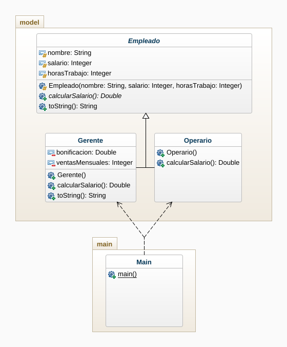

# Empleados abstracto

En una empresa hay dos tipos de empleados, los gerentes y los operarios, los primeros trabajan un número de horas por un salario y reciben bonificaciones por cada venta que realicen adicionalmente. Los operarios únicamente ganan la mitad del salario que reciben por un número de horas trabajadas.

# Diagrama de clases

# Captura de pantalla

