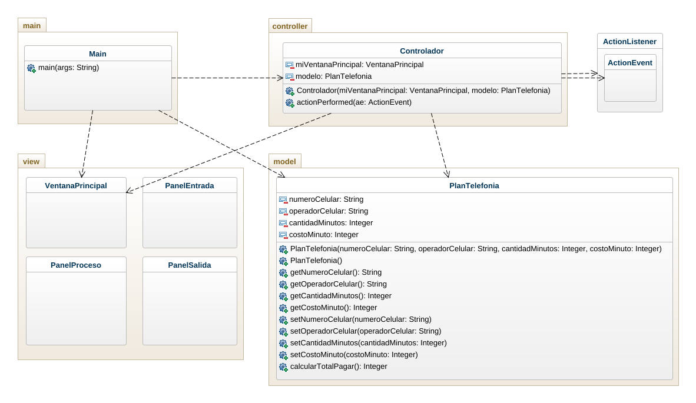

# Plan de telefonía

Crear un programa para gestionar un plan de telefonía móvil. El plan tiene un número de celular, un operador, una cantidad de minutos y un costo por minuto. Calcular el total a pagar teniendo en cuento que si el operador es "Movilujo" tiene un 50% de descuento. Usar mínimo dos métodos constructores.

# Diagrama de clases

# Capturas de pantalla

