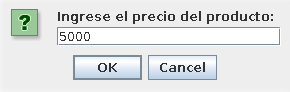
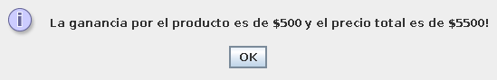

# Ejercicio 2

El dueño de una papelería desea un programa que le indique el precio de venta de un artículo dado. El precio se
calcula con la siguiente fórmula:

P = precioCosto + ganancia

Donde la ganancia será:

- El 15% si el costo es inferior a $3000
- $500 si el costo está entre $3000 y $6000
- El 25% si el costo supera los $6000.

# Captura de pantalla

